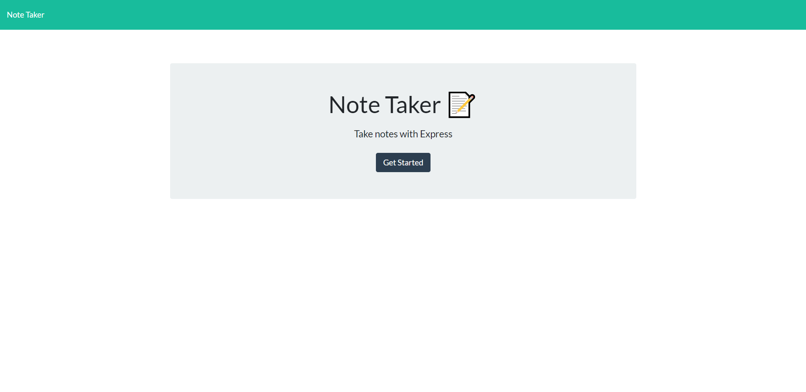
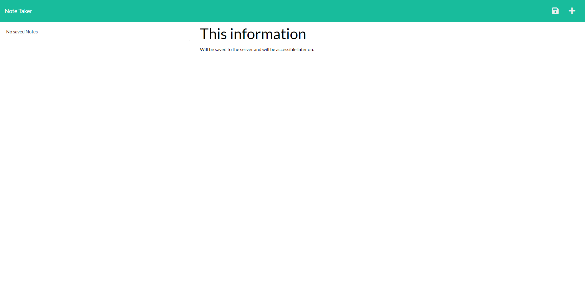
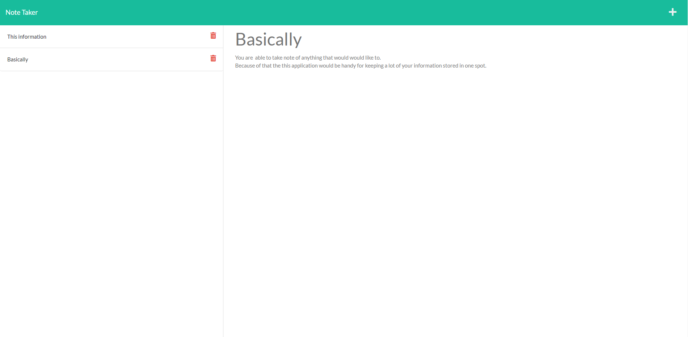

# Note-Taker-Application-Express-JS-Adam-Cleland

### Description

As part of a homework assignment for the Ohio State Full-Stack coding Boot Camp, We are tasked with creating a note taker application that allows the user to write and save notes and have them save into a JSON file for future use.

## Installation

---

Download the Repo and run on your Local machine.

       npm i // to install the required npm packages.

## Usage Information

---

##### To begin the program:

1. Navigate to the director the application is located in through your terminal.
2. Do `npm start` (Make sure to do `npm i` before to make sure the dependencies are properly installed.)
3. Navigate to the hosted page in your browser to view the application once it is launched.

---

The application is also live on HEROKU
<a href="https://dashboard.heroku.com/apps/note-taker-adam-cleland/deploy/github"> Click me to be re-directed to the live site. </a>

## Screenshots

---

## Contributions

---

Pull requests are welcome. For major changes, please open an issue first to discuss what you would like to change.
(This project was part of an assignment for my full stack coding boot-camp; I will not be updating it unless it is required by my class).

## Questions

---

##### For Questions about the application Feel Free to Reach out to me on:

Github [aclelandx](https://github.com/aclelandx)

Email: <aclelandx@gmail.com>

## License

---

Copyright [2022] [Adam Cleland]

    Permission is hereby granted, free of charge, to any person obtaining a copy of this software and associated documentation files (the "Software"), to deal in the Software without restriction, including without limitation the rights to use, copy, modify, merge, publish, distribute, sublicense, and/or sell copies of the Software, and to permit persons to whom the Software is furnished to do so, subject to the following conditions:

    The above copyright notice and this permission notice shall be included in all copies or substantial portions of the Software.

    THE SOFTWARE IS PROVIDED "AS IS", WITHOUT WARRANTY OF ANY KIND, EXPRESS OR IMPLIED, INCLUDING BUT NOT LIMITED TO THE WARRANTIES OF MERCHANTABILITY, FITNESS FOR A PARTICULAR PURPOSE AND NONINFRINGEMENT. IN NO EVENT SHALL THE AUTHORS OR COPYRIGHT HOLDERS BE LIABLE FOR ANY CLAIM, DAMAGES OR OTHER LIABILITY, WHETHER IN AN ACTION OF CONTRACT, TORT OR OTHERWISE, ARISING FROM, OUT OF OR IN CONNECTION WITH THE SOFTWARE OR THE USE OR OTHER DEALINGS IN THE SOFTWARE.
